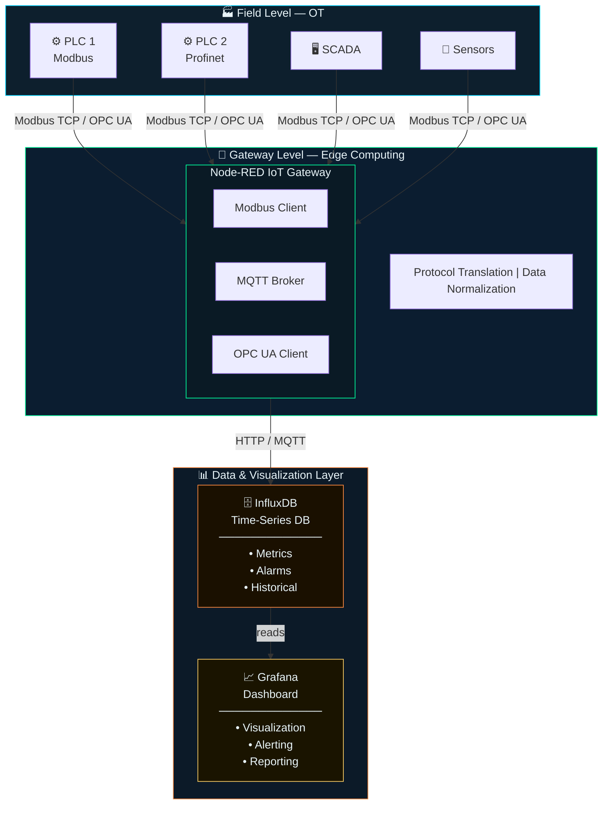

# System Architecture
## Industrial IoT Gateway

> Industrial IoT Gateway per integrazione protocolli OT (Modbus, OPC UA) con piattaforme IT moderne.

---

## 1. Architecture

### 1.1 Layer Overview

---

## 2. Components

### 2.1 Node-RED Gateway (`iot-gateway`)

- **Purpose:** Protocol translation and data routing
- **Technology:** Node.js-based flow programming

**Protocols Supported:**
- Modbus TCP/RTU
- OPC UA Client
- MQTT (publish/subscribe)
- HTTP REST APIs

**Key Functions:**
- Poll PLC data via Modbus
- Normalize data formats
- Apply business logic
- Route to InfluxDB

---

### 2.2 InfluxDB (`timeseries-db`)

- **Purpose:** Time-series data storage
- **Technology:** InfluxDB 2.7

**Data Organization:**
- Organization: `industrial`
- Bucket: `iot-data`
- Retention: 30 days

---

### 2.3 Grafana (`dashboard`)

- **Purpose:** Data visualization and monitoring
- **Technology:** Grafana latest

**Features:**
- Real-time dashboards
- Alerting system
- Multi-source queries

---

## 3. Network Architecture

### 3.1 Port Mapping

| Service   | Internal Port | External Port | Protocol |
|-----------|--------------|--------------|----------|
| Node-RED  | 1880         | 1880         | HTTP     |
| InfluxDB  | 8086         | 8086         | HTTP     |
| Grafana   | 3000         | 3000         | HTTP     |

### 3.2 Data Flow

1. **Data Acquisition:** Node-RED polls PLC via Modbus TCP
2. **Data Processing:** Value scaling and validation
3. **Data Storage:** Write to InfluxDB via HTTP API
4. **Data Visualization:** Grafana queries InfluxDB

---

## 4. Deployment Model

### 4.1 Containerization Benefits

- **Portability:** Run on any Linux system
- **Scalability:** Easy horizontal scaling
- **Isolation:** Services isolated from host
- **Reproducibility:** Consistent environments

### 4.2 Resource Requirements

| Resource | Minimum      | Recommended  |
|----------|-------------|-------------|
| CPU      | 2 cores     | 4+ cores    |
| RAM      | 4 GB        | 8 GB        |
| Storage  | 20 GB       | 50+ GB      |
| Network  | 100 Mbps    | 1 Gbps      |

---

*Document Version: 1.0 — Last Updated: February 2025*
